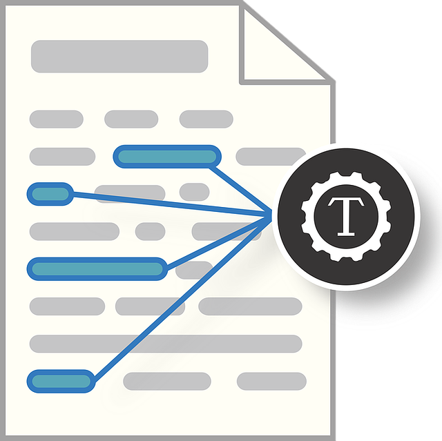

{width=10%}

Bild von <a href="https://pixabay.com/de/users/mcmurryjulie-2375405/?utm_source=link-attribution&amp;utm_medium=referral&amp;utm_campaign=image&amp;utm_content=1476780">mcmurryjulie</a> auf <a href="https://pixabay.com/de//?utm_source=link-attribution&amp;utm_medium=referral&amp;utm_campaign=image&amp;utm_content=1476780">Pixabay</a>

# Twitter Mining


## Vorab


### Lernziele


- Twitterdaten via API von Twitter auslesen


### Vorbereitung

- Lesen Sie in @smltar Kap. 1 und 2.
- Legen Sie sich ein Konto bei [Github](https://github.com/) an.


### R-Pakete


::: {.cell}

```{.r .cell-code}
library(tidyverse)
library(rtweet)
```
:::


{width=10%}


## Anmelden bei Twitter


### Welche Accounts interessieren uns?


Hier ist eine (subjektive) Auswahl von deutschen Politikern,
die einen Startpunkt gibt zur Analyse von Art und Ausmaß von Hate Speech gerichtet an deutsche Politiker:innen.


::: {.cell}

```{.r .cell-code}
d_path <- "data/twitter-german-politicians.csv"

d <- read_csv(d_path)
d
```

::: {.cell-output-display}
<div class="kable-table">

|name                                             |party  |screenname      |comment                                |
|:------------------------------------------------|:------|:---------------|:--------------------------------------|
|Karl Lauterbach                                  |SPD    |Karl_Lauterbach |NA                                     |
|Olaf Scholz                                      |SPD    |OlafScholz      |NA                                     |
|Annalena Baerback                                |Gruene |ABaerbock       |NA                                     |
|Bundesministerium für Wirtschaft und Klimaschutz |Gruene |BMWK            |Robert Habeck ist der Minister im BMWK |
|Friedrich Merz                                   |CDU    |_FriedrichMerz  |CDU-Chef                               |
|Markus Söder                                     |CSU    |Markus_Soeder   |CSU-Chef                               |
|Cem Özdemir                                      |Gruene |cem_oezdemir    |BMEL                                   |
|Janine Wissler                                   |Linke  |Janine_Wissler  |Linke-Chefin                           |
|Martin Schirdewan                                |Linke  |schirdewan      |Linke-Chef                             |
|Christian Lindner                                |FDP    |c_lindner       |FDP-Chef                               |
|Marie-Agnes Strack-Zimmermann                    |FDP    |MAStrackZi      |Vorsitzende Verteidigungsausschuss     |
|Tino Chrupalla                                   |AFD    |Tino_Chrupalla  |AFD-Bundessprecher                     |
|Alice Weidel                                     |AFD    |Alice_Weidel    |AFD-Bundessprecherin                   |

</div>
:::
:::


### Twitter App erstellen

[Tutorial](https://cran.r-project.org/web/packages/rtweet/vignettes/auth.html)


### Intro

Die Seite von [rtweet](https://docs.ropensci.org/rtweet/) gibt eine gute Starthilfe in die Benutzung des Pakets.


### Zugangsdaten


Zugangsdaten sollte man geschützt speichern, also z.B. nicht in einem geteilten Ordner.


::: {.cell}

```{.r .cell-code}
source("/Users/sebastiansaueruser/credentials/hate-speech-analysis-v01-twitter.R")
```
:::


Anmelden:


::: {.cell}

```{.r .cell-code}
auth <- rtweet_bot()
```
:::


## Tweets einlesen


### Timeline einlesen einzelner Accounts


::: {.cell}

```{.r .cell-code}
tweets <- get_timeline(user = d$screenname)
saveRDS(tweets, file = "tweets/tweets01.rds")
```
:::


### Retweets einlesen


::: {.cell}

```{.r .cell-code}
options(rtweet.retryonratelimit = TRUE)
```
:::

::: {.cell}

```{.r .cell-code}
tweets01_retweets <- 
  tweets$id_str %>% 
  head(3) %>% 
  map_dfr( ~ get_retweets(status_id = .x, retryonratelimit = TRUE))
```
:::


Da die meisten Retweets aber nix sagen, sondern nur auf das einen Tweet wiederholen, ist das Sammeln der Retweets ziemlich langweilig.


### EPINetz Twitter Politicians 2021


@konig_epinetz_2022 [Volltext hier](https://link.springer.com/article/10.1007/s11615-022-00405-7) haben einen Datensatz mit knapp 2500 Twitter Accounts deutscher Politiker zusammengestellt, zum Stand 2021.


Der Datensatz kann über [Gesis](https://search.gesis.org/research_data/SDN-10.7802-2415?doi=10.7802/2415) bezogen werden.

Auf der gleichen Seite findet sich auch eine [Dokumentation des Vorgehens](https://access.gesis.org/sharing/2415/3675).


::: {.cell}

```{.r .cell-code}
politicians_path <- "data/EPINetz_TwitterPoliticians_2021.RDs"
politicians_twitter <- read_rds(politicians_path)

head(politicians_twitter)
```

::: {.cell-output-display}
<div class="kable-table">

|   ID|official_name   |party     |region             |institution        |office          |user_id            |twitter_name       |twitter_handle |from       |until | year_of_birth|abgeordnetenwatch_id |gender |wikidata_id |
|----:|:---------------|:---------|:------------------|:------------------|:---------------|:------------------|:------------------|:--------------|:----------|:-----|-------------:|:--------------------|:------|:-----------|
|  535|Manja Schüle    |SPD       |Brandenburg        |State Parliament   |Parliamentarian |827090742162100224 |Manja Schüle       |ManjaSchuele   |2019-09-25 |NA    |          1976|146790               |female |Q40974942   |
|  962|Petra Pau       |DIE LINKE |Federal            |Federal Parliament |Parliamentarian |1683845126         |Team PetraPau      |TeamPetraPau   |2017-10-24 |NA    |          1963|79091                |female |Q77195      |
|  864|Dagmar Schmidt  |SPD       |Federal            |Federal Parliament |Parliamentarian |1377117206         |Team #dieschmidt   |TeamDieSchmidt |2017-10-24 |NA    |          1973|79036                |female |Q15433815   |
| 2517|Bernd Buchholz  |FDP       |Schleswig-Holstein |State Parliament   |Parliamentarian |1073605033         |Bernd Buchholz     |BerndBuchholz  |2017-06-06 |NA    |          1961|121092               |male   |Q823715     |
| 1378|Ingrid Remmers  |DIE LINKE |Federal            |Federal Parliament |Parliamentarian |551802475          |Ingrid Remmers MdB |ingrid_remmers |2017-10-24 |NA    |          1965|120775               |female |Q1652660    |
| 1116|Reinhard Brandl |CSU       |Federal            |Federal Parliament |Parliamentarian |262730721          |Reinhard Brandl    |reinhardbrandl |2017-10-24 |NA    |          1977|79427                |male   |Q111160     |

</div>
:::
:::

::: {.cell}

```{.r .cell-code}
epi_tweets <- 
  politicians_twitter$user_id %>% 
  head() %>% 
    get_timeline(user = ., n = 10)


epi_tweets <- get_timeline(user = head(politicians_twitter$twitter_name), n = 10)
head(epi_tweets)
```
:::


### Followers suchen


::: {.cell}

```{.r .cell-code}
followers01 <-
  d$screenname %>% 
 map_dfr( ~ get_followers(user = .x, retryonratelimit = TRUE))

saveRDS(followers01, file = "tweets/followers01.rds")
```
:::


Damit haben wir eine Liste an Followers, deren Tweets wir einlesen und analysieren können,
z.B. nach Hate Speech.


## Aufgaben

1. Überlegen Sie, wie Sie das Ausmaß an Hate Speech, dem deutsche Politikerinnen und Politiker konfrontiert sind, messen können.
2. Argumentieren Sie die Vorteile und Nachteile Ihres Ansatzes. Außerdem, auf welches Ergebnis dieser Analyse sie gespannt sind bzw. wären.
1. Erstellen Sie sich eine Liste an Personen, deren Tweets sich lohnen (könnten), auf Hate Speech hin analysiert zu werden. Laden Sie deren Tweets (ggf. in Auszügen) herunter.
